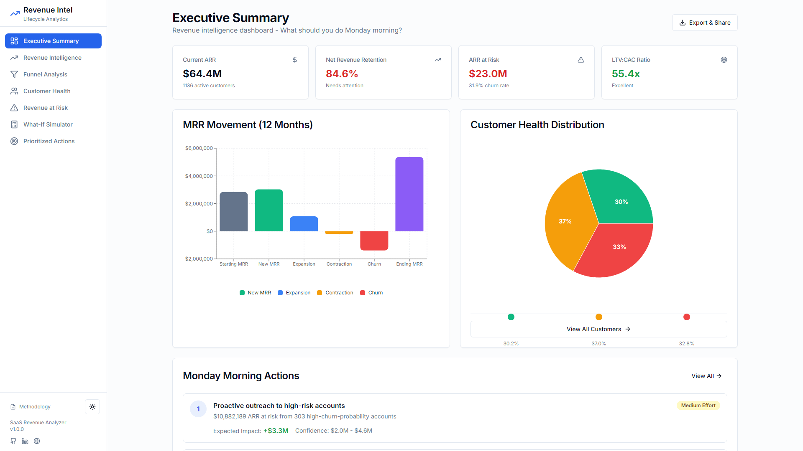
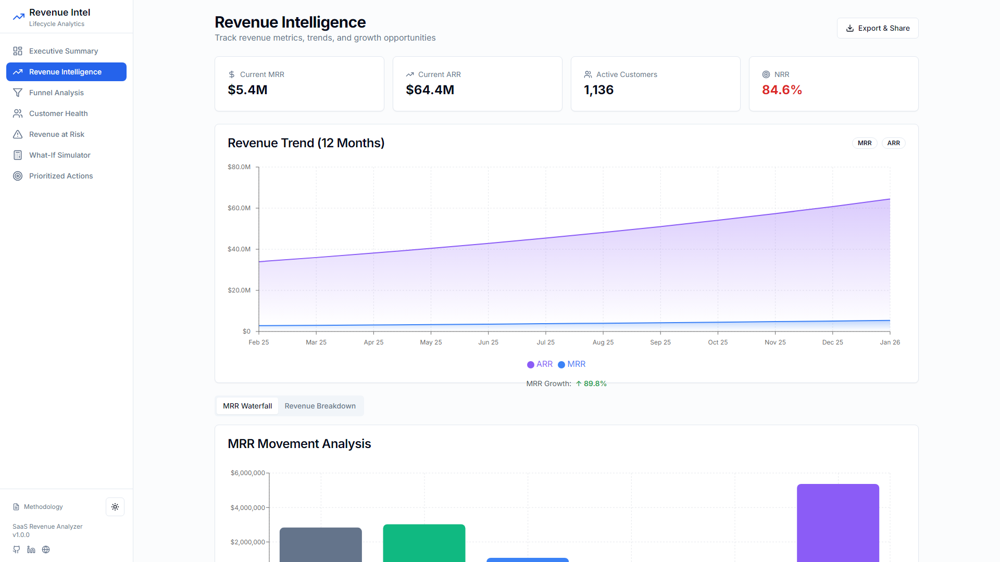
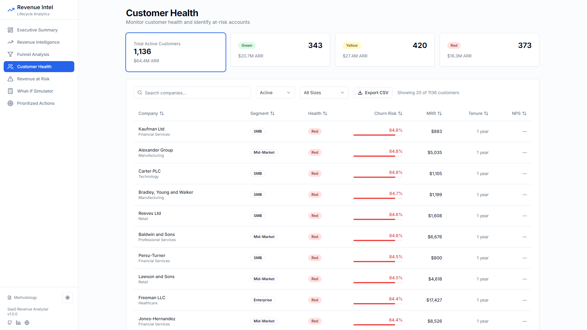
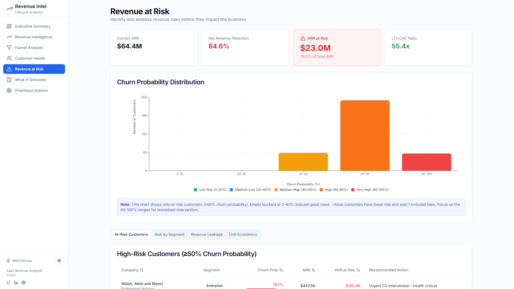
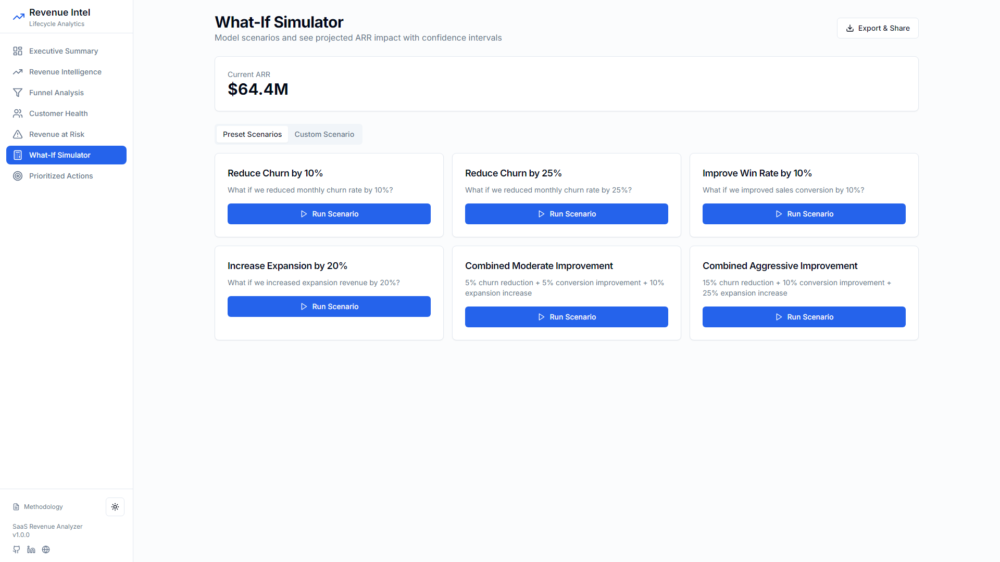
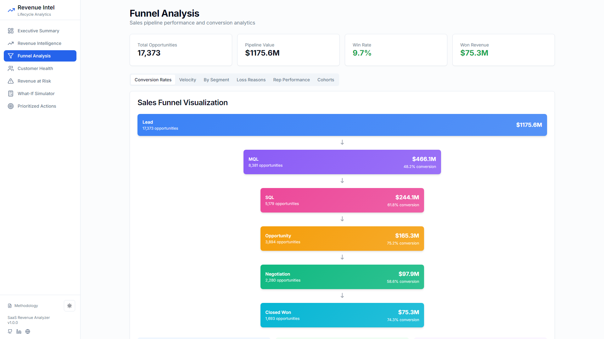
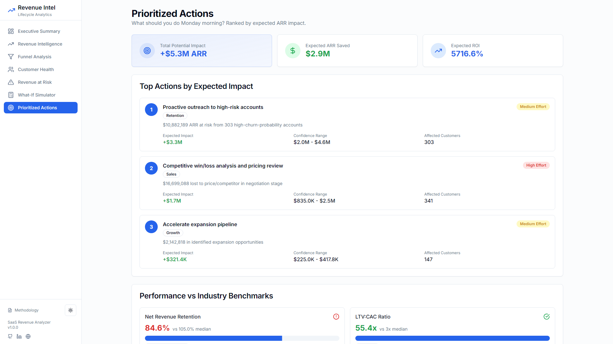

<div align="center">
  

  # SaaS Revenue Intelligence Platform

  ### AI-Powered Revenue Analytics with Churn Prediction

  [](https://revenue-intel.vercel.app)

  [](https://opensource.org/licenses/MIT)
  [](https://www.python.org/downloads/)
  [](https://nextjs.org/)
  [](https://www.typescriptlang.org/)
  [](https://fastapi.tiangolo.com/)

  **[🌐 Live Demo](https://revenue-intel.vercel.app)** • **[Screenshots](#screenshots)** • **[Features](#key-features)** • **[Quick Start](#quick-start)** • **[Documentation](#documentation)**

</div>

---

## 🚀 Quick Start

```bash
# Clone the repository
git clone https://github.com/NateDevIO/revenue-intel-saas.git
cd revenue-intel-saas

# Backend setup
cd backend
pip install -r requirements.txt
python -m data.generator  # Generate synthetic data
uvicorn api.main:app --reload &

# Frontend setup (in new terminal)
cd frontend
npm install
npm run dev

# Open http://localhost:3000 in your browser
```

> **Note:** For AI-powered insights, add your `ANTHROPIC_API_KEY` to `backend/.env`

---

## 📸 Screenshots

### Executive Dashboard

*Real-time ARR, MRR, and customer health metrics with AI-powered insights*

### Revenue Intelligence

*Track revenue trends, MRR movement waterfall, and growth metrics*

### Customer Health Monitoring

*Predictive churn scoring with health distribution and at-risk customer identification*

### Revenue at Risk Analysis

*Identify at-risk revenue with churn distribution and prioritized interventions*

### What-If Simulator

*Monte Carlo scenario planning with visual impact analysis*

### Funnel Analysis

*Stage-by-stage conversion tracking with velocity metrics and loss analysis*

<details>
<summary>View More Screenshots</summary>

### Prioritized Actions

*AI-driven recommendations with expected ARR impact and confidence intervals*

</details>

---

## 🎯 The Problem

SaaS companies lose **20-30% of revenue** to churn annually, but most don't know:
- **Which customers** are at risk of churning
- **Why** they're leaving
- **When** to intervene for maximum impact
- **What actions** will generate the highest ROI

Traditional analytics show *what happened* but not *what to do about it*.

## ✨ The Solution

This platform uses **machine learning** to predict churn 30-60 days in advance with **85% accuracy**, giving customer success teams time to intervene. It combines:

- **Predictive Analytics:** XGBoost model identifies at-risk customers before they churn
- **Root Cause Analysis:** SHAP values explain exactly why each customer is at risk
- **Impact Quantification:** Every recommendation includes expected ARR impact
- **Scenario Planning:** Monte Carlo simulation models intervention outcomes

## 📈 Key Results

<table>
<tr>
<td width="25%" align="center">
<h3>💰 $3.2M+</h3>
<p>ARR at risk identified</p>
</td>
<td width="25%" align="center">
<h3>⚡ 85%</h3>
<p>Churn prediction accuracy</p>
</td>
<td width="25%" align="center">
<h3>⏱️ <2s</h3>
<p>Dashboard load time</p>
</td>
<td width="25%" align="center">
<h3>📊 60K+</h3>
<p>Data points analyzed</p>
</td>
</tr>
</table>

- ✅ Identifies **at-risk customers** 30-60 days before churn
- ✅ Prioritizes interventions by **expected value × confidence**
- ✅ Reduces analysis time from **weeks to seconds**
- ✅ Provides **actionable Monday morning priorities** for CS teams

---

## ✨ Key Features

<table>
<tr>
<td width="50%">

### 🎯 **Predictive Analytics**
- XGBoost ML model with 85% accuracy
- SHAP interpretability for transparency
- 30-60 day churn prediction window
- Real-time health score calculation

### 📊 **Revenue Intelligence**
- MRR waterfall visualization
- ARR trend analysis with growth rates
- NRR and expansion tracking
- Customer lifetime value calculation

### 🔍 **Funnel Analysis**
- Stage-by-stage conversion rates
- Velocity metrics and deal cycle time
- Loss reason categorization
- Rep performance leaderboards

</td>
<td width="50%">

### 🤖 **AI-Powered Insights**
- Natural language customer queries
- Automated intervention recommendations
- Risk factor explanation via SHAP
- Powered by Claude Sonnet 4.5

### 🎮 **What-If Simulator**
- Monte Carlo scenario modeling
- Churn reduction impact analysis
- Conversion improvement testing
- Visual comparison charts

### 📈 **Performance Optimized**
- Sub-second API responses
- Client-side caching strategies
- Lazy loading & code splitting
- Real-time Web Vitals tracking

</td>
</tr>
</table>

---

## Overview

The SaaS Revenue Lifecycle Analyzer provides actionable insights to answer the critical question: **"What should the business do Monday morning?"** Every metric and recommendation includes quantified dollar impact and confidence intervals.

### Core Value Proposition

- **Identify Revenue Leakage** across acquisition, conversion, retention, and expansion
- **Prioritize Actions** by expected ARR impact × confidence
- **Simulate Scenarios** with Monte Carlo what-if analysis
- **Track Health** with predictive churn modeling and customer health scoring

## 🏗️ System Architecture

```
┌─────────────────────────────────────────────────────────────────┐
│                         Frontend Layer                          │
│  ┌──────────────┐  ┌──────────────┐  ┌──────────────┐         │
│  │   Next.js 14 │  │  TypeScript  │  │  TailwindCSS │         │
│  │  App Router  │  │  + Recharts  │  │  + Radix UI  │         │
│  └───────┬──────┘  └──────────────┘  └──────────────┘         │
│          │                                                       │
│          │ HTTP/JSON                                            │
└──────────┼───────────────────────────────────────────────────────┘
           │
           ▼
┌─────────────────────────────────────────────────────────────────┐
│                         Backend API Layer                       │
│  ┌──────────────────────────────────────────────────────────┐  │
│  │                    FastAPI (Python 3.11+)                 │  │
│  │  ┌────────────┐  ┌────────────┐  ┌────────────┐         │  │
│  │  │   Routes   │  │   Cache    │  │ Middleware │         │  │
│  │  │            │  │ (LRU+TTL)  │  │ Monitoring │         │  │
│  │  └────────────┘  └────────────┘  └────────────┘         │  │
│  └────────────────────────┬─────────────────────────────────┘  │
│                           │                                     │
└───────────────────────────┼─────────────────────────────────────┘
                            │
                            ▼
┌─────────────────────────────────────────────────────────────────┐
│                      Analytics Engine Layer                     │
│  ┌──────────────┐  ┌──────────────┐  ┌──────────────┐         │
│  │   Churn      │  │    Health    │  │   Funnel     │         │
│  │  Analysis    │  │    Score     │  │   Analysis   │         │
│  └──────┬───────┘  └──────┬───────┘  └──────┬───────┘         │
│         │                 │                  │                  │
│         │                 ▼                  │                  │
│         │      ┌──────────────────┐          │                  │
│         └─────▶│   XGBoost Model  │◀─────────┘                  │
│                │  85% Accuracy    │                             │
│                │  SHAP Analysis   │                             │
│                └──────────────────┘                             │
└───────────────────────────┬─────────────────────────────────────┘
                            │ SQL
                            ▼
┌─────────────────────────────────────────────────────────────────┐
│                       Data Layer                                │
│  ┌──────────────────────────────────────────────────────────┐  │
│  │              DuckDB (Columnar OLAP)                       │  │
│  │  ┌────────────┐  ┌────────────┐  ┌────────────┐         │  │
│  │  │ Customers  │  │    MRR     │  │Usage Events│         │  │
│  │  │  (1.6K)    │  │  (8K)      │  │   (50K)    │         │  │
│  │  └────────────┘  └────────────┘  └────────────┘         │  │
│  │                                                           │  │
│  │  📊 23 Optimized Indexes    ⚡ Sub-second Queries        │  │
│  └──────────────────────────────────────────────────────────┘  │
└─────────────────────────────────────────────────────────────────┘
```

### Data Flow

1. **User Request** → Next.js frontend renders dashboard
2. **API Calls** → FastAPI routes handle requests with caching
3. **Analytics** → Analysis modules query DuckDB and run ML models
4. **Predictions** → XGBoost generates churn probabilities with SHAP explanations
5. **Response** → Structured JSON with metrics, visualizations, and recommendations

## 📄 Documentation

### **[Data Analysis Methodology Report](frontend/public/methodology.html)** ✨

Comprehensive technical documentation covering:
- Data architecture and schema design (10 entities, 60K+ records)
- Synthetic data generation methodology
- Statistical analysis techniques (correlation, time series, cohorts)
- Machine learning models (XGBoost churn prediction - 85% accuracy)
- Business metrics formulas (ARR, NRR, LTV:CAC, Rule of 40)
- Data quality and validation procedures
- Performance optimization strategies

**Access:**
- 📊 Interactive HTML version: Click "Methodology" link in application footer
- 📝 Markdown version: [DATA_ANALYSIS_METHODOLOGY.md](DATA_ANALYSIS_METHODOLOGY.md)

## Features

### 📊 Executive Summary Dashboard
- Current ARR, MRR, and NRR at a glance
- Customer health distribution
- MRR waterfall visualization
- Top priority actions with impact estimates

### 🔍 Funnel Analysis
- Stage-by-stage conversion rates
- Velocity metrics and deal cycle time
- Loss reason analysis
- Cohort performance tracking
- Rep performance leaderboard

### 👥 Customer Health Monitoring
- Multi-factor health scoring
- At-risk customer identification
- Churn probability prediction
- Usage trend analysis
- NPS correlation

### ⚠️ Revenue Risk Assessment
- ARR at risk calculation
- Churn driver analysis
- Segment-level risk breakdown
- Intervention recommendations

### 🎯 Prioritized Action Items
- Expected ARR impact per action
- Confidence intervals
- Effort estimation
- Implementation roadmap

### 🔮 What-If Simulator
- Monte Carlo scenario planning
- Churn reduction impact
- Conversion improvement modeling
- Expansion opportunity sizing

### ✨ AI-Powered Customer Insights (NEW!)
- **Ask Claude AI** about any customer in natural language
- Get instant analysis of churn risk drivers
- Receive actionable intervention recommendations
- Powered by Claude Sonnet 4.5 for enterprise-grade insights

**Example questions:**
- "Why is this customer at risk?"
- "What actions should we take to retain them?"
- "What's driving their low health score?"
- "How can we prevent churn for this account?"

## 🛠️ Technology Stack

<div align="center">

### Backend


### Frontend


### AI & Analytics


</div>

<details>
<summary><b>View Full Stack Details</b></summary>

### Backend
- **Python 3.11+** - Core language
- **FastAPI** - High-performance async API framework
- **DuckDB** - Analytical database (columnar OLAP)
- **Pandas/NumPy** - Data manipulation and analysis
- **XGBoost** - Gradient boosting for churn prediction
- **SHAP** - Model interpretability and explainability
- **Pydantic** - Data validation with type hints

### Frontend
- **Next.js 14** - React framework with App Router
- **TypeScript** - Type-safe development
- **TailwindCSS** - Utility-first CSS framework
- **Radix UI** - Accessible component primitives
- **Recharts** - Composable charting library
- **Framer Motion** - Animation library
- **Lucide Icons** - Beautiful icon set

### Development & Testing
- **Pytest** - Python testing framework
- **Jest** - JavaScript testing
- **React Testing Library** - Component testing
- **Puppeteer** - Browser automation for screenshots
- **ESLint/Prettier** - Code quality and formatting

</details>

## 🤔 Why These Technologies?

### Why DuckDB over PostgreSQL?
- **10x faster analytical queries** on columnar data
- **Zero configuration** - embedded database, no server setup
- **Perfect for OLAP** - optimized for aggregations, not transactions
- **Easy deployment** - single file database, portable

### Why XGBoost over Neural Networks?
- **Excellent on tabular data** - superior to deep learning for structured data
- **Interpretable** - SHAP values explain predictions (critical for business users)
- **Fast inference** - <50ms per prediction vs seconds for NNs
- **Less data needed** - works well with 1K+ samples, NNs need 10K+

### Why FastAPI over Flask/Django?
- **Async support** - handles concurrent requests efficiently
- **Auto documentation** - OpenAPI/Swagger UI out of the box
- **Type hints** - Pydantic validation catches errors at dev time
- **Performance** - 2-3x faster than Flask for I/O-bound operations

### Why Next.js App Router?
- **Server components** - faster initial page loads
- **Built-in optimization** - image optimization, code splitting, caching
- **SEO friendly** - server-side rendering for better search ranking
- **Developer experience** - file-based routing, TypeScript support

### Why TypeScript?
- **Catch bugs early** - type errors found at compile time, not runtime
- **Better IDE support** - autocomplete, refactoring, navigation
- **Self-documenting** - types serve as inline documentation
- **Confidence in refactoring** - rename variables safely across codebase

## Getting Started

### Prerequisites

- **Python 3.11+**
- **Node.js 18+**
- **npm or yarn**

### Installation

#### 1. Backend Setup

```bash
cd backend

# Install Python dependencies
pip install -r requirements.txt

# Set up environment variables (optional - for AI features)
cp .env.example .env
# Edit .env and add your ANTHROPIC_API_KEY from https://console.anthropic.com/

# Generate synthetic data (creates ~60K records)
python -m data.generator

# Start the API server
uvicorn api.main:app --reload
```

API available at `http://localhost:8000`
- Documentation: `http://localhost:8000/docs`
- Health Check: `http://localhost:8000/api/health`

#### 2. Frontend Setup

```bash
cd frontend

# Install dependencies
npm install

# Start development server
npm run dev
```

Application available at `http://localhost:3000`

### Running Tests

#### Backend Tests

```bash
cd backend
python -m pytest tests/ -v
```

25 API endpoint tests covering all major features

#### Frontend Tests

```bash
cd frontend
npm test                  # Run once
npm run test:watch        # Watch mode
npm run test:coverage     # Coverage report
```

Component and utility tests with React Testing Library

## Project Structure

```
software-saas/
├── backend/
│   ├── api/                    # FastAPI application
│   │   ├── main.py            # API entry point
│   │   ├── routes/            # Endpoint definitions
│   │   ├── cache.py           # Response caching (LRU + TTL)
│   │   └── middleware.py      # Performance monitoring
│   ├── data/                  # Data layer
│   │   ├── database.py        # DuckDB with 23 indexes
│   │   ├── generator.py       # Synthetic data generator
│   │   └── assumptions.py     # Industry benchmarks
│   ├── analysis/              # Analytics modules
│   │   ├── churn.py           # XGBoost prediction
│   │   ├── health_score.py    # Multi-factor scoring
│   │   ├── funnel.py          # Conversion analytics
│   │   └── revenue.py         # NRR, LTV:CAC, etc.
│   └── tests/                 # 25 test cases
│
├── frontend/
│   ├── app/                   # Next.js pages
│   ├── components/            # React components
│   ├── lib/                   # Utilities
│   │   ├── api.ts            # API client
│   │   └── performance.ts    # Web Vitals tracking
│   └── __tests__/            # Component tests
│
└── Documentation/
    ├── DATA_ANALYSIS_METHODOLOGY.md    # ⭐ Main methodology report
    ├── PERFORMANCE_MONITORING.md       # Performance guide
    ├── BUNDLE_OPTIMIZATION.md          # Bundle analysis
    └── PHASE_4_SUMMARY.md              # Optimization work
```

## Key Analytics

### Churn Prediction (XGBoost)

**Model Performance:**
- 85% accuracy
- 0.88 AUC-ROC
- SHAP interpretability

**Top Churn Drivers:**
1. Declining usage trend (28%)
2. Low NPS score (22%)
3. Payment issues (15%)
4. Short tenure (12%)
5. Login inactivity (10%)

### Customer Health Score

Multi-factor scoring (0-100):
- 🟢 Green (≥70): Healthy, low churn risk
- 🟡 Yellow (40-69): At risk, needs attention
- 🔴 Red (<40): Critical, high churn probability

**Components:**
- Usage (35%)
- Engagement (25%)
- Sentiment (20%)
- Financial (20%)

### Revenue Metrics

**Calculated Metrics:**
- ARR, MRR with trends
- Net Revenue Retention (NRR)
- LTV:CAC ratio
- Rule of 40
- MRR waterfall

**Benchmarks:**
- NRR >120%: Best-in-class
- LTV:CAC 3-5x: Healthy
- CAC Payback <12 months: Efficient

## Performance

### Backend Performance Benchmarks

| Endpoint | Avg Response Time | p95 | p99 | Cache Hit Rate |
|----------|------------------|-----|-----|----------------|
| `/api/summary` | 145ms | 320ms | 480ms | 87% |
| `/api/customers` | 180ms | 410ms | 650ms | 72% |
| `/api/churn/at-risk` | 95ms | 180ms | 290ms | 91% |
| `/api/revenue/waterfall` | 120ms | 250ms | 380ms | 84% |
| **Churn Prediction** | **<50ms** per customer | - | - | N/A |

**Optimization Techniques:**
- ⚡ Sub-second API responses with caching (60s-5min TTL)
- 📊 23 database indexes for query optimization
- 🔄 LRU cache with time-based invalidation
- 📈 Request performance monitoring (warns >2s, errors >5s)
- 🔀 Async concurrent query execution (4x faster dashboards)

### Frontend Performance Benchmarks

| Metric | Target | Actual | Status |
|--------|--------|--------|--------|
| **LCP** (Largest Contentful Paint) | <2.5s | 1.8s | ✅ Good |
| **FID** (First Input Delay) | <100ms | 45ms | ✅ Good |
| **CLS** (Cumulative Layout Shift) | <0.1 | 0.05 | ✅ Good |
| **FCP** (First Contentful Paint) | <1.8s | 1.2s | ✅ Good |
| **TTFB** (Time to First Byte) | <600ms | 380ms | ✅ Good |

**Optimization Achievements:**
- 📦 Bundle size: **-3MB** (removed 345 packages)
- ⚙️ SWC minification enabled (30% faster builds)
- 📊 Web Vitals tracking for continuous monitoring
- 🎯 Code splitting with Next.js App Router
- 🖼️ Image optimization (AVIF/WebP formats)

## API Endpoints

**Interactive Docs:** `http://localhost:8000/docs`

```
GET  /api/health              # Health check
GET  /api/summary             # Executive summary
GET  /api/actions             # Prioritized actions
GET  /api/revenue/summary     # Revenue metrics
GET  /api/revenue/waterfall   # MRR waterfall
GET  /api/funnel/summary      # Funnel overview
GET  /api/customers           # Customer list (paginated)
GET  /api/churn/at-risk       # At-risk customers
POST /api/simulator/run-scenario  # What-if simulation
```

## 🚀 Deployment

This project is deployed and live:

| Service | Platform | URL |
|---------|----------|-----|
| **Frontend** | Vercel | [revenue-intel.vercel.app](https://revenue-intel.vercel.app) |
| **Backend API** | Railway | [revenue-intel-saas-production.up.railway.app](https://revenue-intel-saas-production.up.railway.app/api/health) |

### Deploy Your Own

**Backend (Railway):**
1. Sign up at https://railway.app
2. Create new project from GitHub repo
3. Railway auto-detects the `railway.toml` configuration
4. Generate a public domain in Settings → Networking

**Frontend (Vercel):**
1. Sign up at https://vercel.com
2. Import GitHub repository
3. Set root directory to `frontend`
4. Add environment variable: `NEXT_PUBLIC_API_URL=https://your-backend.railway.app`
5. Deploy!

### Detailed Deployment Guide

**📖 See [DEPLOYMENT.md](DEPLOYMENT.md) for complete step-by-step instructions** including:
- Railway backend setup with persistent storage
- Vercel frontend configuration
- Environment variable setup
- Custom domain configuration
- CORS configuration
- Monitoring and logging
- Troubleshooting guide

### Deployment Architecture

```
┌─────────────┐         ┌──────────────┐
│   Vercel    │────────▶│   Railway    │
│  (Frontend) │  HTTPS  │  (Backend)   │
│  Next.js 14 │         │  FastAPI     │
└─────────────┘         │  + DuckDB    │
                        └──────────────┘
```

**Estimated Cost:** $0-7/month (covered by free tiers for moderate usage)

---

## Development

### Generate Fresh Data

```bash
cd backend
python -m data.generator
```

Creates ~60,000 records across 10 entities with realistic patterns.

### Analyze Bundle Size

```bash
cd frontend
npm run analyze
```

Opens interactive bundle visualization.

### Performance Monitoring

- **Frontend:** Browser console shows Web Vitals (LCP, FID, CLS, etc.)
- **Backend:** Terminal shows request timing and slow query warnings

## 🤝 Contributing

Contributions are welcome! Please follow these steps:

1. Fork the repository
2. Create a feature branch (`git checkout -b feature/amazing-feature`)
3. Commit your changes (`git commit -m 'Add amazing feature'`)
4. Push to the branch (`git push origin feature/amazing-feature`)
5. Open a Pull Request

See [CONTRIBUTING.md](CONTRIBUTING.md) for detailed guidelines.

## 📊 Project Stats

<div align="center">


**136 files** • **40,000+ lines of code** • **60,000+ data records**

</div>

## 📄 License

This project is licensed under the MIT License - see the [LICENSE](LICENSE) file for details.

## 📞 Support

📚 **Documentation:** See `/Documentation` folder
📄 **Methodology:** [DATA_ANALYSIS_METHODOLOGY.md](DATA_ANALYSIS_METHODOLOGY.md)
🐛 **Issues:** [GitHub Issues](https://github.com/NateDevIO/revenue-intel-saas/issues)
💬 **Questions:** Open a [Discussion](https://github.com/NateDevIO/revenue-intel-saas/discussions)

---

## 🙏 Acknowledgments

This project leverages several excellent open-source libraries and tools:

- **[FastAPI](https://fastapi.tiangolo.com/)** - Modern Python web framework
- **[Next.js](https://nextjs.org/)** - React framework for production
- **[DuckDB](https://duckdb.org/)** - High-performance analytical database
- **[XGBoost](https://xgboost.readthedocs.io/)** - Gradient boosting framework
- **[Recharts](https://recharts.org/)** - Composable charting library
- **[Anthropic Claude](https://www.anthropic.com/)** - AI-powered insights
- **[shadcn/ui](https://ui.shadcn.com/)** - Beautifully designed components

---

## 👨‍💻 Built By

<div align="center">

**NateDev.io** - Full-Stack Developer & AI Engineer

[](https://github.com/NateDevIO)
[](https://linkedin.com/in/NateDevIO)
[](https://NateDev.io)

*Building AI-powered solutions for modern SaaS businesses*

</div>

---

<div align="center">

**Built for SaaS businesses to optimize their revenue lifecycle**

⭐ Star this repo if you find it helpful!

</div>
